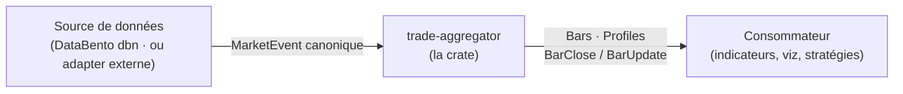
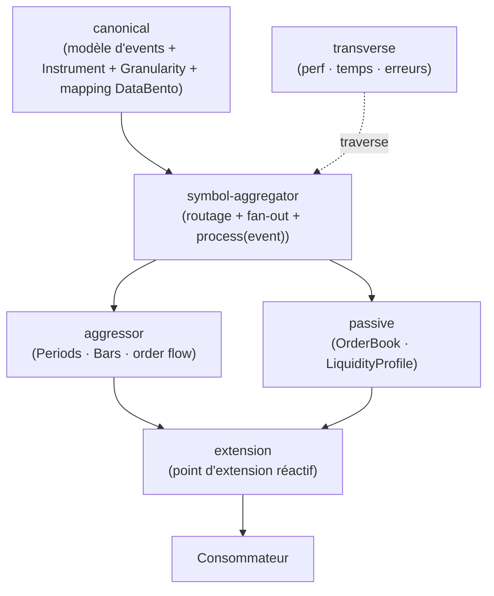

# Architecture — trade-aggregator (racine)

> Niveau racine de la descente **C4** (Contexte → Composants → … → Code). Dérivée des
> [features](../vision/features.md), des [piliers](../vision/piliers.md) et du
> [domaine](../domain/concepts.md). Chaque nœud riche se re-décompose dans son
> sous-dossier ; un nœud simple est une feuille.

## Contexte (niveau 1)

Le système est **une librairie (crate)** : `trade-aggregator`. Deux externes l'entourent.



- **Source** : produit des `MarketEvent` au **format canonique** (le mapping DataBento
  vit *dans* la crate, isolé ; les adapters par venue sont *hors* scope).
- **Consommateur** : s'abonne au **point d'extension** et calcule ce qu'il veut (la crate
  n'interprète pas).

## Composants internes (niveau 2)

Dérivés des thèmes de features et des concepts du domaine.



| Composant | Rôle | Richesse |
|---|---|---|
| **canonical** | Contrat d'entrée : `MarketEvent` (Trade/BookUpdate), `Instrument`, `Granularity`, `AggressorSide` + **mapping DataBento** isolé. | feuille |
| **symbol-aggregator** | Orchestration : route les events vers les deux côtés, fan-out vers N `Period`, boucle `process(event)` (live = replay). | feuille |
| **aggressor** | `AggressorAggregator` : `Period` → `Bar` + order flow (`Footprint`, `Delta`/CVD, `POC`, `ValueArea`, `TPO`). | **riche → sous-dossier** |
| **passive** | `PassiveAggregator` : **reconstruction de l'`OrderBook`** + `LiquidityProfile` périodiques. | **riche → sous-dossier** |
| **extension** | Point d'extension réactif : push/pull, `BarClose` / `BarUpdate`, alignement des deux côtés. | feuille |
| **transverse/** | Préoccupations qui traversent tout : performance/zero-alloc, gestion du temps (event-time), erreurs. | dossier transverse |

## Arbre (réel)

```
docs/architecture/
├── README.md                    ← (ici) contexte + composants
├── canonical.md                 ← feuille : modèle d'entrée + mapping DataBento
├── symbol-aggregator.md         ← feuille : routage + fan-out + process(event)
├── aggressor/                   ← nœud riche
│   ├── README.md                  Period · Bar
│   └── orderflow/               ← sous-nœud riche
│       ├── README.md              trait BarComponent
│       ├── footprint.md
│       ├── volume-profile.md      (POC / ValueArea)
│       ├── tpo.md
│       └── delta-cvd.md
├── passive/                     ← nœud riche
│   ├── README.md
│   ├── orderbook.md               reconstruction du carnet
│   └── liquidity-profile.md       agrégation périodique
├── extension.md                 ← feuille : point d'extension réactif
└── transverse/
    └── README.md                ← perf · temps (event-time) · erreurs
```

> Condition d'arrêt atteinte : chaque feuille décrit une unité dont l'intérieur = le code
> (Phase 7). **Chaque feature de la Vision a désormais un endroit clair où vivre.**
