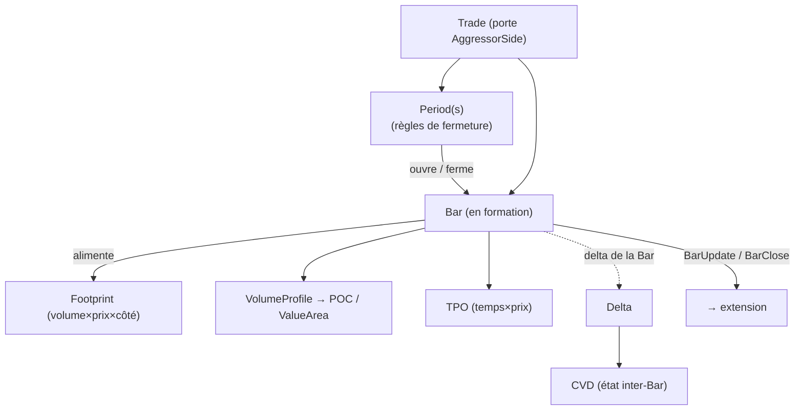

# aggressor/ — AggressorAggregator

> Nœud **riche** de l'archi. Parent : [`../README.md`](../README.md). Concepts :
> [`../../domain/glossaire.md`](../../domain/glossaire.md).
>
> **Rôle** : agréger le flux **agressif** (les `Trade`) en `Bar`, selon une ou plusieurs
> `Period` en parallèle, et calculer l'**order flow** de chaque `Bar`.

## Vue d'ensemble

## Sous-composants

### `Period` — la règle de fermeture
Décide **quand** la `Bar` courante se ferme. Famille homogène de règles (un même rôle,
plusieurs variantes) : Time, Tick, Volume, Dollar/Notional, Range, Renko, Imbalance,
Run, hybride. **Plusieurs `Period` tournent en parallèle** sur le même flux (multi-charts).
- *État* : chaque `Period` maintient son propre seuil/compteur (temps écoulé, volume
  cumulé, range courant, déséquilibre cumulé pour les imbalance bars…).
- *Forme esquissée* : un trait `Period` du type `on_trade(&mut self, &Trade) -> Boundary`
  (continue / ferme-et-rouvre), + `reset`.

### `Bar` — l'accumulateur
Unité en **formation** puis **fermée**. Accumule l'`OHLCV` et **délègue** aux lentilles
order flow. Émet un `BarUpdate` à chaque `Trade` intégré, un `BarClose` à la fermeture.

### Lentilles order flow (attachées à la `Bar`)
- **Footprint** : `prix → (volume Bid, volume Ask)`, alimenté par chaque `Trade` selon son
  `AggressorSide`. Lentille **volume**.
- **VolumeProfile → POC / ValueArea** : distribution du volume par prix → `POC` (max),
  `ValueArea` (~70 %). *(Footprint et VolumeProfile partagent « volume par prix ».)*
- **TPO** : distribution du **temps** par prix → POC/VA en version temps.
- **Delta / CVD** : `Delta` = volume agressif Buy − Sell de la `Bar` ; **`CVD`** = somme
  courante des deltas → **état porté par l'agrégateur** (inter-`Bar`), pas par la `Bar`.

## Composabilité

Les lentilles sont **optionnelles et composables** : à la création d'une `Period`, on
choisit les lentilles voulues (footprint seul, ou footprint + TPO, etc.). Forme esquissée :
un trait commun `BarComponent` (`on_trade`, `on_close`).
> ⚠️ Ressemble *en surface* à l'idée modulaire de `trade_aggregation`, mais : (a) on fait
> **maison**, (b) nos lentilles sont des **profils par niveau de prix**, pas des composants
> scalaires.

## Capacités / granularité

Le flux agressif (les `Trade` avec `AggressorSide`) suffit à **tout** l'order flow ici —
ce nœud n'a **pas** besoin du book. La granularité L1/L2/L3 n'impacte donc l'aggressor
que via la disponibilité de l'`AggressorSide` (fallback si `None`, cf. transverse).

## Descente

Les lentilles order flow sont riches → re-décomposées dans **[`orderflow/`](orderflow/)** :

| Sous-nœud | Fichier |
|---|---|
| Vue d'ensemble + trait `BarComponent` | [`orderflow/README.md`](orderflow/README.md) |
| Footprint | [`orderflow/footprint.md`](orderflow/footprint.md) |
| VolumeProfile → POC / ValueArea | [`orderflow/volume-profile.md`](orderflow/volume-profile.md) |
| TPO | [`orderflow/tpo.md`](orderflow/tpo.md) |
| Delta / CVD | [`orderflow/delta-cvd.md`](orderflow/delta-cvd.md) |

`Period` et `Bar` restent décrits ici (feuilles de ce nœud). Le détail des types vient en
**Phase 7**.
