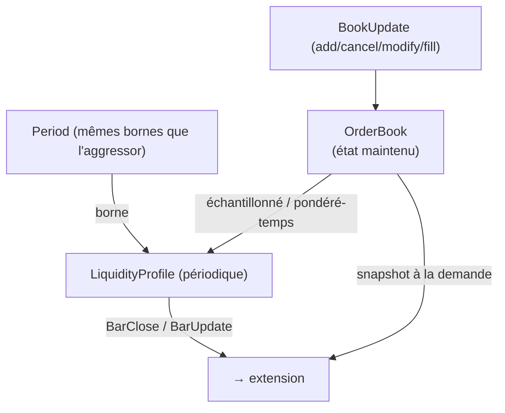

# passive/ — PassiveAggregator

> Nœud **riche**. Parent : [`../README.md`](../README.md). Concepts :
> [`../../domain/glossaire.md`](../../domain/glossaire.md).
>
> **Rôle** : **maintenir** l'`OrderBook` (reconstruction depuis les `BookUpdate`) et
> **agréger** son état en `LiquidityProfile` par `Period`.

## Vue d'ensemble

## Sous-composants

| Sous-nœud | Rôle | Fichier |
|---|---|---|
| **OrderBook (reconstruction)** | tenir l'état instantané du carnet depuis le flux d'events | [`orderbook.md`](orderbook.md) |
| **LiquidityProfile** | agréger cet état sur une `Period` | [`liquidity-profile.md`](liquidity-profile.md) |

## Alignement avec l'aggressor

Les `Period` du côté passif partagent les **mêmes bornes** que celles du côté agressif →
les deux profils (order flow / liquidité) sont **comparables sur la même fenêtre**
(pilier **P5**, exigence d'alignement).

## Capacités / granularité

- **L1 (BBO)** : insuffisant pour un profil de liquidité de profondeur → `PassiveAggregator`
  **refusé à la construction** (fail-fast).
- **L2 (MBP)** : profil par **niveau de prix** (quantité agrégée).
- **L3 (MBO)** : par **ordre individuel** (file d'attente) → permet de dériver le L2 ; le
  détail par ordre reste disponible (mais toute *interprétation* — ex. position dans la
  file — est hors scope).

---

## Fiches features (Phase 5)

> Niveau orchestration du nœud passif ; les fiches détaillées sont dans
> [`orderbook.md`](orderbook.md) et [`liquidity-profile.md`](liquidity-profile.md).

- **`PAS-1`** — Routage `BookUpdate` → maintien + profils · **P1** · *un book update met à jour le book puis les profils.*
- **`PAS-2`** — Alignement des `Period` sur le côté agressif · **P1** · *profils passifs sur les mêmes bornes que l'order flow.*
- **`PAS-3`** — Refus fail-fast si `Granularity` = L1 · **P1** · *PassiveAggregator impossible sans profondeur.*
