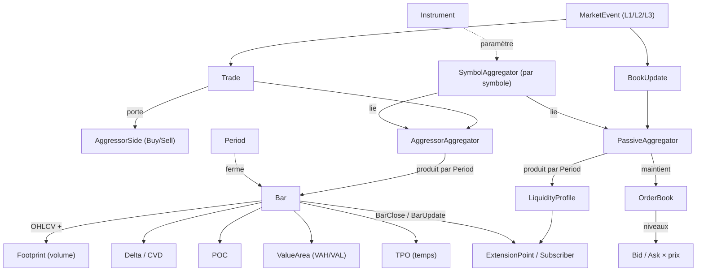

# Concepts & relations — trade-aggregator

> Carte des concepts du **domaine métier** et de leurs relations. Définitions :
> [`glossaire.md`](glossaire.md). (Le mapping vers des types Rust = Phase 4.)

## Diagramme de concepts

## Lecture des relations

- Un **SymbolAggregator** existe **par symbole** ; il porte l'**Instrument** et **lie**
  les deux agrégateurs, vers lesquels il **route** les `MarketEvent`.
- Les **Trade** alimentent l'**AggressorAggregator** ; les **BookUpdate** alimentent le
  **PassiveAggregator**. *(Dualité : pilier P1.)*
- Une **Period** ferme une **Bar** ; un agrégateur peut faire tourner **plusieurs Period
  en parallèle** (multi-charts).
- Une **Bar** porte ses lentilles : **Footprint** (volume), **TPO** (temps), plus
  **Delta/CVD**, **POC**, **ValueArea**.
- Le **PassiveAggregator** maintient l'**OrderBook** (niveaux **Bid/Ask**) et en produit
  des **LiquidityProfile** périodiques.
- Tout sort par l'**ExtensionPoint** (`BarClose` / `BarUpdate`), les deux côtés alignés
  temporellement. *(Pilier P5.)*

## Frontières (rappel — cf. `../vision/scope.md`)

- `AggressorSide (Buy/Sell)` ≠ `Bid/Ask` : côté de l'**agression** vs côté du **book**.
- **Footprint** (volume) ≠ **TPO** (temps) : deux lentilles complémentaires d'une `Bar`.
- Tout concept ici est de l'**agrégation** ; l'interprétation (signaux, absorption…)
  est **hors domaine** (hors scope).
