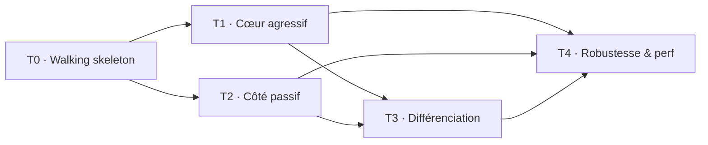

# Roadmap — trade-aggregator

> **Ordre de construction**. Chaque tranche s'appuie sur la précédente et produit quelque
> chose d'**intégrable et testable** (en replay sur le dataset DataBento). Dérive du
> graphe de dépendances de [`architecture/`](architecture/README.md) + des priorités de
> [`vision/features.md`](vision/features.md). Les IDs renvoient aux fiches Phase 5.
>
> En **Phase 7**, chaque tranche = **une branche → une PR**.

## Graphe des tranches

> T1 et T2 dépendent tous deux de T0 (canonical + symbol-aggregator + extension), mais sont
> **indépendants entre eux** → T2 peut suivre T1 ou se paralléliser plus tard. On séquence
> **T1 avant T2** (agressif avant passif : plus simple, livre de la valeur plus tôt).

---

## T0 — Walking skeleton  *(P0)*

**But** : `trades → barres temporelles → callback`, **en replay**. Tranche verticale
minimale prouvant le pipeline et le déterminisme.

- **canonical** : `CAN-1` (Trade), `CAN-3` (AggressorSide), `CAN-4` (MarketEvent),
  `CAN-5` (Instrument), `CAN-6` (Granularity), `CAN-7` (capacités), `CAN-8` (mapping trades),
  `CAN-11` (mapping side), `CAN-12` (feature-gate)
- **symbol-aggregator** : `SYM-1` (process), `SYM-2` (routage Trade), `SYM-4` (fan-out),
  `SYM-5`+`SYM-6` (config), `SYM-8` (fail-fast), `SYM-11` (flush)
- **aggressor** : `AGG-P0` (trait Period), `AGG-P1` (TimePeriod), `AGG-B1` (état Bar),
  `AGG-B2` (OHLCV), `AGG-B4` (BarClose)
- **extension** : `EXT-1` (Subscriber on_bar_close)
- **transverse** : `TR-3` (event-time), `TR-4` (timestamp), `TR-6` (fail-fast)

**Testable** : rejouer un fichier trades DataBento → bougies 1 min identiques à une référence.

---

## T1 — Cœur agressif  *(P1)*  — dépend de T0

**But** : la proposition de valeur agressive (périodes variées + order flow + extension complète).

- **periods** : `AGG-P2` (aligned), `AGG-P4` (tick), `AGG-P5` (volume), `AGG-P6` (dollar),
  `AGG-P7` (range), `AGG-P8` (Renko)
- **bar** : `AGG-B3` (BarUpdate), `AGG-B5` (bar partielle)
- **order flow** : `OF-0` (trait BarComponent), `OF-COMP` (composabilité), `FP-1`/`FP-2`
  (footprint), `VP-1`/`VP-2`/`VP-3` (volume profile/POC/VA), `DC-1`/`DC-2` (delta/CVD)
- **extension** : `EXT-2` (on_bar_update), `EXT-3` (dispatch zero-cost), `EXT-4` (channel),
  `EXT-5` (Stream)
- **transverse** : `TR-1` (zero-alloc), `TR-2` (monomorphisation), `TR-8` (erreurs mapping)

**Testable** : footprint/delta/POC/VA d'une barre comparés à une référence.

---

## T2 — Côté passif  *(P1 → P2)*  — dépend de T0

**But** : la dualité complète (reconstruction du book + profils de liquidité).

- **canonical** : `CAN-9` (mapping MBO), `CAN-10` (mapping definition), `CAN-13` (mapping L2)
- **symbol-aggregator** : `SYM-3` (routage BookUpdate), `SYM-7` (config profils),
  `SYM-9` (alignement)
- **passive** : `PAS-1…3`, `OB-1…9` (reconstruction), `OB-10` (intégrité), `LP-1…6` (profils)
- **extension** : `EXT-6` (état interrogeable), `EXT-7` (alignement deux côtés)
- **transverse** : `TR-7` (resync)

**Testable** : reconstruire le book depuis MBO et comparer best bid/ask à une référence.

---

## T3 — Différenciation  *(P2)*  — dépend de T1 (+ T2)

**But** : les features qui nous distinguent.

- **periods** : `AGG-P3` (session), `AGG-P9` (P&F), `AGG-P10/11/12` (imbalance bars),
  `AGG-P13` (run bars), `AGG-P14` (hybride)
- **order flow** : `FP-3` (imbalances diagonales), `TPO-1…5` (TPO/Market Profile),
  `DC-3` (min/max delta)
- **transverse** : `TR-5` (détection désordre)

**Testable** : imbalance bars & TPO d'un dataset comparés à une référence.

---

## T4 — Robustesse & performance  *(P2 / P3)*  — dépend de T1+T2+T3

**But** : prêt pour un usage sérieux / publication.

- **transverse** : `TR-10` (bornes mémoire), `TR-9` (métriques, P3)
- **extension** : `EXT-8` (cycle de vie abonnés)
- Durcissement des cas limites + **benchmarks** du hot path.

**Testable** : flux long sans dérive mémoire ; benchmarks sous seuils cibles.

---

## Vérification des dépendances

- **Aucune tranche ne s'appuie sur du non-construit** : T0 ne dépend de rien ; T1 et T2
  ne touchent que l'infra de T0 ; T3 réutilise les lentilles/periods (T1) et, pour les
  profils, le book (T2) ; T4 est transverse final.
- Chaque tranche est **intégrable** (compile + s'intègre au code existant) et **testable**
  (rejeu déterministe sur dataset DataBento).
