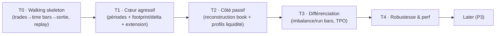

# Stratégie — trade-aggregator

> Stratégie de construction en **tranches macro**, dérivée des priorités de
> [`features.md`](features.md). La séquence **fine et ordonnée** (graphe de dépendances)
> viendra en **Phase 6 — Priorisation** (`docs/roadmap.md`) ; ici on pose les grandes
> tranches.

## Principes directeurs

- **Vertical d'abord** : le squelette traverse *toutes* les couches tôt
  (entrée → agrégation → sortie) pour valider le pipeline avant d'élargir.
- **Agressif avant passif** : le tape est plus simple que la reconstruction du book ; on
  livre de la valeur plus vite, et le côté passif réutilise l'infra déjà posée
  (`SymbolAggregator`, exposition).
- **Solide avant différenciant** : footprint/delta (éprouvé) avant imbalance bars / TPO
  (plus subtils). *(validé)*
- **Replay-driven** : chaque tranche se valide en **rejouant le dataset DataBento**
  (déterminisme event-time).
- **Chaque tranche = intégrable et testable** sur le code déjà écrit.

## Tranches macro

### Tranche 0 — Walking skeleton  *(P0)*
Le pipeline vertical le plus mince, de bout en bout, **en replay** :
modèle d'événements canonique (trades) + instrument + mapping *trades* DataBento →
`SymbolAggregator` (routage + `process(event)`) → `AggressorAggregator` avec **barres
temporelles** → sortie `on_bar_close`.
→ *Prouve l'architecture et le déterminisme avant tout élargissement.*

### Tranche 1 — Cœur agressif  *(P1)*
- Périodes : tick / volume / dollar bars, range / Renko.
- Order flow : **footprint + delta/CVD + POC/Value Area**.
- **Point d'extension complet** (push/pull, `on_bar_update`, alignement).
→ *La proposition de valeur côté agressif est livrée.*

### Tranche 2 — Côté passif  *(P1 → P2)*
- **Reconstruction du carnet** (book builder depuis MBO) + ingestion MBO DataBento.
- Profils de liquidité passifs (pondéré-temps, snapshots, churn, depth).
→ *La dualité Aggressor / Passive est complète.*

### Tranche 3 — Différenciation  *(P2)*
- **Imbalance / run bars**, barres hybrides, Point & Figure.
- **TPO / Market Profile**.
→ *Les features qui nous distinguent de l'existant.*

### Tranche 4 — Robustesse & performance  *(P2, transverse)*
- Cas limites (events désordonnés, gaps, resync du book), durcissement du hot path,
  benchmarks.
→ *Prêt pour un usage sérieux / publication.*

### Later  *(P3)*
Variantes de profils/périodes additionnelles, ergonomie d'API avancée, autres mappings
de format.

## Vue d'ensemble

